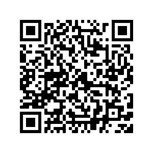
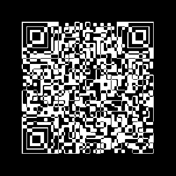
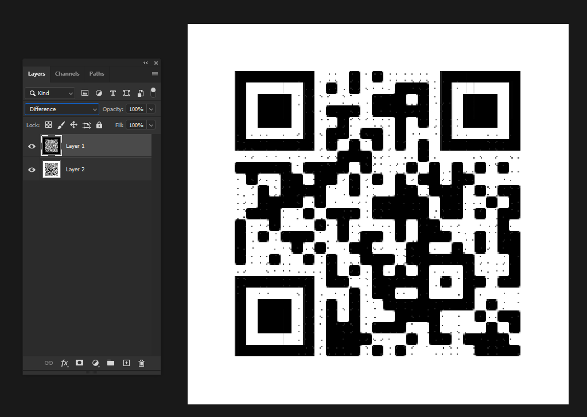
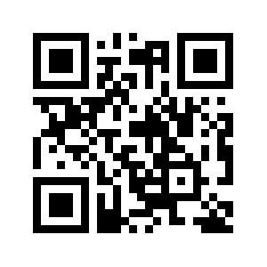

# CM01
> 250pts

## Briefing
> Download the file and find a way to get the flag.

## Solution
The provided file can be found [here](cm01.zip).



Scanning the first QR code, `frame.png`, gives us the output `Hey, I've put the flag into the other file using the same trick we always use.  You know what to do. :)`.



This means we need to focus on the QR code `code.png`.

### Solution 1

Opening the image in Adobe Photoshop and subtract the black one from the white one - also known as changing your layer type to `Difference`:



Now this is good enough to get the flag, however if you happen to have no life you can do a touch of post-processing. For all you nerds, this is done by leveling out a lot of noise followed by scaling it down then back up using nearest neighbour:



The QR code now outputs `FLAG: A_Code_For_A_Code`.

### Solution 2

Try to `XOR` pixels of two images by `PIL` to a image, `logical_xor.png`

```python
from PIL import Image, ImageChops

img1 = Image.open('code.png').convert('1')
img2 = Image.open('frame.png').convert('1')

result = ImageChops.logical_xor(img1, img2)
result.save('logical_xor.png')
```


And then qr decode it by `zbar`

```
zbarimg logical_xor.png
> QR-Code:FLAG: A_Code_For_A_Code
```

## Flag
Flag: `A_Code_For_A_Code`
