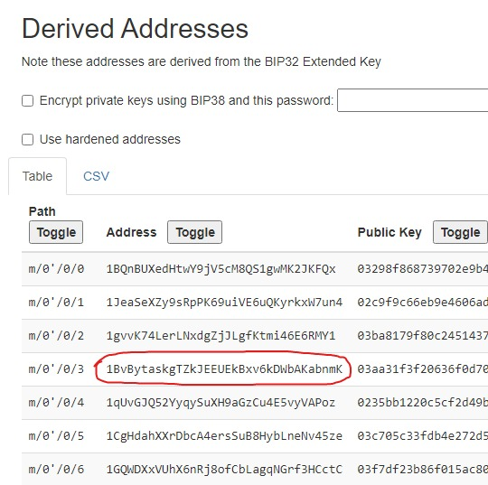

# CX01
> 1,000pts

## Briefing
> Complete the missing BIP39 mnemonic seed phrase and get address `3` at BIP32 derivation path `m/0'/0` as the flag.

> `nature midnight buzz toe sleep fence kiwi ivory excuse system ____ ______`

> You will need to make use of this, as the start of the 128 char BIP39 seed:

> `131c553f7fb4127e7b2b346991dd92`

## Solution

BIP stands for Bitcoin Improvement Protocol, and BIP39 is all about using mnemonics to remember seeds. I wrote a python script to complete the mnemonic.
```py
import urllib.request
from bip_utils import Bip39MnemonicValidator, Bip39SeedGenerator

link = "https://raw.githubusercontent.com/bitcoin/bips/master/bip-0039/english.txt"
f = urllib.request.urlopen(link)
words = f.read().decode().split()

mm = "nature midnight buzz toe sleep fence kiwi ivory excuse system".split()
seed = b"\x13\x1c\x55\x3f\x7f\xb4\x12\x7e\x7b\x2b\x34\x69\x91\xdd\x92"

for word1 in words:
    if len(word1) != 4:
        continue
    for word2 in words:
        if len(word2) != 6:
            continue
        m = " ".join(mm + [word1, word2])
        if Bip39MnemonicValidator(m).Validate():
            if Bip39SeedGenerator(m).Generate().startswith(seed):
                print(m)
```
To find the correct two words in the mnemonic, I need to check that first it is valid (BIP39 mnemonics contain a checksum) and then that the start of the seed matches what we've been given.

My script starts by importing `urllib.request` (for getting the list of all BIP39 words) and `bip_utils`, which does all computation of the protocol for me. The next section reads in the list of words into an array, and after that I define the start of the mnemonic and the start of the seed. There are four dashes for the first word and six for the second, which I (correctly) assumed to indicate the length of the words. Thus, before I do any proper validation I make sure the words are that length. Then I validate, and if that succeeds, check if the seed starts with the correct value. If it does, I print out the solved mnemonic.

This script (eventually) prints out `nature midnight buzz toe sleep fence kiwi ivory excuse system exit filter`.

Using https://iancoleman.io/bip39/, I put the mnemonic in and selected BIP32 Derivation. I entered the Derivation Path as `m/0'/0`, and sure enough I found the flag.



## Flag
Flag: `1BvBytaskgTZkJEEUEkBxv6kDWbAKabnmK`
