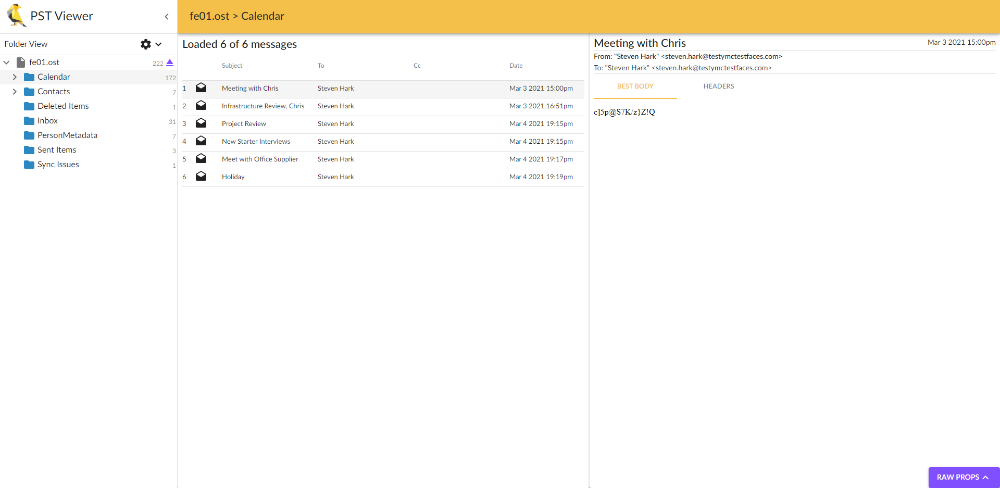

# FE01
> 100pt

## Briefing
> Download the file and find a way to get the flag.

## Solution
The provided file can be found [here](fe01.zip).

Using [pffexport](http://manpages.ubuntu.com/manpages/trusty/man1/pffexport.1.html), we can extract everything from `fe01.ost`:

```console
CDSkids@kali:~/Desktop$ pffexport fe01.ost
pffexport 20180714

Opening file.
Exporting items.
Exporting folder item 1 out of 2.
Exporting folder item 2 out of 2.
Exporting appointment item 1 out of 1.
Exporting email item 1 out of 31.
Exporting recipient.
Exporting email item 2 out of 31.
Exporting recipient.
Exporting email item 3 out of 31.
Exporting recipient.
Exporting email item 4 out of 31.
Exporting recipient.
Exporting email item 5 out of 31.
Exporting recipient.
Exporting email item 6 out of 31.
Exporting recipient.
Exporting attachment 1 out of 16.
Exporting attachment 2 out of 16.
Exporting attachment 3 out of 16.
Exporting attachment 4 out of 16.
Exporting attachment 5 out of 16.
Exporting attachment 6 out of 16.
Exporting attachment 7 out of 16.
Exporting attachment 8 out of 16.
Exporting attachment 9 out of 16.
Exporting attachment 10 out of 16.
Exporting attachment 11 out of 16.
Exporting attachment 12 out of 16.
Exporting attachment 13 out of 16.
Exporting attachment 14 out of 16.
Exporting attachment 15 out of 16.
Exporting attachment 16 out of 16.
Exporting email item 7 out of 31.
Exporting recipient.
Exporting email item 8 out of 31.
Exporting recipient.
Exporting email item 9 out of 31.                                                                                 
Exporting recipient.                                                                                              
Exporting email item 10 out of 31.                                                                                
Exporting recipient.                                                                                              
Exporting email item 11 out of 31.                                                                                
Exporting recipient.                                                                                              
Exporting email item 12 out of 31.                                                                                
Exporting recipient.                                                                                              
Exporting email item 13 out of 31.                                                                                
Exporting recipient.                                                                                              
Exporting email item 14 out of 31.                                                                                
Exporting recipient.
Exporting email item 15 out of 31.
Exporting recipient.
Exporting email item 16 out of 31.
Exporting recipient.
Exporting email item 17 out of 31.
Exporting recipient.
Exporting email item 18 out of 31.
Exporting recipient.
Exporting attachment 1 out of 1.
Exporting email item 19 out of 31.
Exporting recipient.
Exporting email item 20 out of 31.
Exporting recipient.
Exporting email item 21 out of 31.
Exporting recipient.
Exporting email item 22 out of 31.
Exporting recipient.
Exporting attachment 1 out of 1.
Exporting email item 23 out of 31.
Exporting recipient.
Exporting email item 24 out of 31.
Exporting recipient.
Exporting email item 25 out of 31.
Exporting recipient.
Exporting email item 26 out of 31.
Exporting recipient.
Exporting email item 27 out of 31.
Exporting recipient.
Exporting email item 28 out of 31.
Exporting recipient.
Exporting email item 29 out of 31.
Exporting recipient.
Exporting email item 30 out of 31.
Exporting recipient.
Exporting email item 31 out of 31.
Exporting recipient.
Exporting email item 1 out of 3.
Exporting recipient.
Exporting email item 2 out of 3.
Exporting recipient.
Exporting email item 3 out of 3.
Exporting recipient.
Exporting contact item 1 out of 7.
Exporting contact item 2 out of 7.
Exporting contact item 3 out of 7.
Exporting contact item 4 out of 7.
Exporting contact item 5 out of 7.
Exporting contact item 6 out of 7.
Exporting contact item 7 out of 7.
Skipped item 1 out of 7 of type: IPM.AbchPerson.
Skipped item 2 out of 7 of type: IPM.AbchPerson.
Skipped item 3 out of 7 of type: IPM.AbchPerson.
Skipped item 4 out of 7 of type: IPM.AbchPerson.
Skipped item 5 out of 7 of type: IPM.AbchPerson.
Skipped item 6 out of 7 of type: IPM.AbchPerson.
Skipped item 7 out of 7 of type: IPM.AbchPerson.
Exporting appointment item 1 out of 166.
Exporting appointment item 2 out of 166.
Exporting appointment item 3 out of 166.
Exporting appointment item 4 out of 166.
Exporting appointment item 5 out of 166.
Exporting appointment item 6 out of 166.
Exporting appointment item 7 out of 166.
Exporting appointment item 8 out of 166.
Exporting appointment item 9 out of 166.
Exporting appointment item 10 out of 166.
Exporting appointment item 11 out of 166.
Exporting appointment item 12 out of 166.
Exporting appointment item 13 out of 166.
Exporting appointment item 14 out of 166.
Exporting appointment item 15 out of 166.
Exporting appointment item 16 out of 166.
Exporting appointment item 17 out of 166.
Exporting appointment item 18 out of 166.
Exporting appointment item 19 out of 166.
Exporting appointment item 20 out of 166.
Exporting appointment item 21 out of 166.
Exporting appointment item 22 out of 166.
Exporting appointment item 23 out of 166.
Exporting appointment item 24 out of 166.
Exporting appointment item 25 out of 166.
Exporting appointment item 26 out of 166.
Exporting appointment item 27 out of 166.
Exporting appointment item 28 out of 166.
Exporting appointment item 29 out of 166.
Exporting appointment item 30 out of 166.
Exporting appointment item 31 out of 166.
Exporting appointment item 32 out of 166.
Exporting appointment item 33 out of 166.
Exporting appointment item 34 out of 166.
Exporting appointment item 35 out of 166.
Exporting appointment item 36 out of 166.
Exporting appointment item 37 out of 166.
Exporting appointment item 38 out of 166.
Exporting appointment item 39 out of 166.
Exporting appointment item 40 out of 166.
Exporting appointment item 41 out of 166.
Exporting appointment item 42 out of 166.
Exporting appointment item 43 out of 166.
Exporting appointment item 44 out of 166.
Exporting appointment item 45 out of 166.
Exporting appointment item 46 out of 166.
Exporting appointment item 47 out of 166.
Exporting appointment item 48 out of 166.
Exporting appointment item 49 out of 166.
Exporting appointment item 50 out of 166.
Exporting appointment item 51 out of 166.
Exporting appointment item 52 out of 166.
Exporting appointment item 53 out of 166.
Exporting appointment item 54 out of 166.
Exporting appointment item 55 out of 166.
Exporting appointment item 56 out of 166.
Exporting appointment item 57 out of 166.
Exporting appointment item 58 out of 166.
Exporting appointment item 59 out of 166.
Exporting appointment item 60 out of 166.
Exporting appointment item 61 out of 166.
Exporting appointment item 62 out of 166.
Exporting appointment item 63 out of 166.
Exporting appointment item 64 out of 166.
Exporting appointment item 65 out of 166.
Exporting appointment item 66 out of 166.
Exporting appointment item 67 out of 166.
Exporting appointment item 68 out of 166.
Exporting appointment item 69 out of 166.
Exporting appointment item 70 out of 166.
Exporting appointment item 71 out of 166.
Exporting appointment item 72 out of 166.
Exporting appointment item 73 out of 166.
Exporting appointment item 74 out of 166.
Exporting appointment item 75 out of 166.
Exporting appointment item 76 out of 166.
Exporting appointment item 77 out of 166.
Exporting appointment item 78 out of 166.
Exporting appointment item 79 out of 166.
Exporting appointment item 80 out of 166.
Exporting appointment item 81 out of 166.
Exporting appointment item 82 out of 166.
Exporting appointment item 83 out of 166.
Exporting appointment item 84 out of 166.
Exporting appointment item 85 out of 166.
Exporting appointment item 86 out of 166.
Exporting appointment item 87 out of 166.
Exporting appointment item 88 out of 166.
Exporting appointment item 89 out of 166.
Exporting appointment item 90 out of 166.
Exporting appointment item 91 out of 166.
Exporting appointment item 92 out of 166.
Exporting appointment item 93 out of 166.
Exporting appointment item 94 out of 166.
Exporting appointment item 95 out of 166.
Exporting appointment item 96 out of 166.
Exporting appointment item 97 out of 166.
Exporting appointment item 98 out of 166.
Exporting appointment item 99 out of 166.
Exporting appointment item 100 out of 166.
Exporting appointment item 101 out of 166.
Exporting appointment item 102 out of 166.
Exporting appointment item 103 out of 166.
Exporting appointment item 104 out of 166.
Exporting appointment item 105 out of 166.
Exporting appointment item 106 out of 166.
Exporting appointment item 107 out of 166.
Exporting appointment item 108 out of 166.
Exporting appointment item 109 out of 166.
Exporting appointment item 110 out of 166.
Exporting appointment item 111 out of 166.
Exporting appointment item 112 out of 166.
Exporting appointment item 113 out of 166.
Exporting appointment item 114 out of 166.
Exporting appointment item 115 out of 166.
Exporting appointment item 116 out of 166.
Exporting appointment item 117 out of 166.
Exporting appointment item 118 out of 166.
Exporting appointment item 119 out of 166.
Exporting appointment item 120 out of 166.
Exporting appointment item 121 out of 166.
Exporting appointment item 122 out of 166.
Exporting appointment item 123 out of 166.
Exporting appointment item 124 out of 166.
Exporting appointment item 125 out of 166.
Exporting appointment item 126 out of 166.
Exporting appointment item 127 out of 166.
Exporting appointment item 128 out of 166.
Exporting appointment item 129 out of 166.
Exporting appointment item 130 out of 166.
Exporting appointment item 131 out of 166.
Exporting appointment item 132 out of 166.
Exporting appointment item 133 out of 166.
Exporting appointment item 134 out of 166.
Exporting appointment item 135 out of 166.
Exporting appointment item 136 out of 166.
Exporting appointment item 137 out of 166.
Exporting appointment item 138 out of 166.
Exporting appointment item 139 out of 166.
Exporting appointment item 140 out of 166.
Exporting appointment item 141 out of 166.
Exporting appointment item 142 out of 166.
Exporting appointment item 143 out of 166.
Exporting appointment item 144 out of 166.
Exporting appointment item 145 out of 166.
Exporting appointment item 146 out of 166.
Exporting appointment item 147 out of 166.
Exporting appointment item 148 out of 166.
Exporting appointment item 149 out of 166.
Exporting appointment item 150 out of 166.
Exporting appointment item 151 out of 166.
Exporting appointment item 152 out of 166.
Exporting appointment item 153 out of 166.
Exporting appointment item 154 out of 166.
Exporting appointment item 155 out of 166.
Exporting appointment item 156 out of 166.
Exporting appointment item 157 out of 166.
Exporting appointment item 158 out of 166.
Exporting appointment item 159 out of 166.
Exporting appointment item 160 out of 166.
Exporting appointment item 161 out of 166.
Exporting appointment item 162 out of 166.
Exporting appointment item 163 out of 166.
Exporting appointment item 164 out of 166.
Exporting appointment item 165 out of 166.
Exporting appointment item 166 out of 166.
Exporting appointment item 1 out of 6.
Exporting recipient.
Exporting appointment item 2 out of 6.
Exporting recipient.
Exporting appointment item 3 out of 6.
Exporting recipient.
Exporting appointment item 4 out of 6.
Exporting recipient.
Exporting appointment item 5 out of 6.
Exporting recipient.
Exporting appointment item 6 out of 6.
Exporting recipient.
Exporting email item 1 out of 1.

Export completed.
```

This exports everything from the `.ost` file into something we can open a bit easier!

However, there is loads of emails sent so a quick grep search reveals what we are looking for:

```console
CDSkids@kali:~/Desktop/fe01.ost.export$ grep -r "flag" ./
Binary file ./Root - Mailbox/IPM_SUBTREE/Inbox/Message00018/Attachments/1_flag.zip matches
```

When we try to unzip `1_flag.zip`, we are greeted with a password protected zip:

```console
CDSkids@kali:~/Desktop/fe01.ost.export/Root - Mailbox/IPM_SUBTREE/Inbox/Message00018/Attachments$ unzip 1_flag.zip
Archive:  1_flag.zip
[1_flag.zip] flag.jpg password:
```

Looking at the email sent with this file we get the clue `Here it is.  The p/w is the same one I gave to you in the office when we arranged Fridays meeting.  You still have that right?`.

So, the password was discussed in the office between Chris Kellogg and Steven Hark. However we can find Steven emailed it to himself using an online PST viewer such as [GoldFynch](https://goldfynch.com/pst-viewer/index.html):



`Meeting with Chris` contains the information `c]5p@S7K/z}Z!Q`, which happens to be the `1_flag.zip` password:

```console
CDSkids@kali:~/Desktop/fe01.ost.export/Root - Mailbox/IPM_SUBTREE/Inbox/Message00018/Attachments$ unzip 1_flag.zip
Archive:  1_flag.zip
[1_flag.zip] flag.jpg password:
  inflating: flag.jpg            
```

`flag.jpg` is the following:


Effectively I overcomplicated the challenge a lot more than intended! 

## Flag
Flag: `pst_i'm_in_here!`
