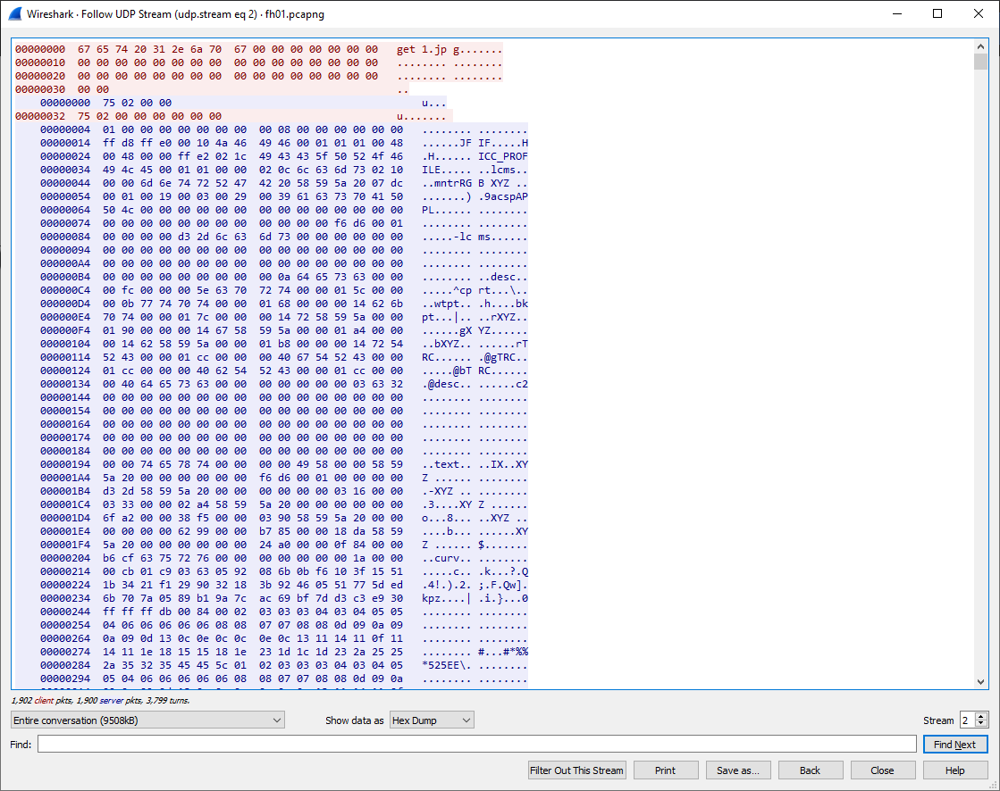
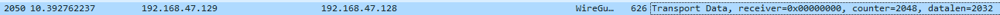
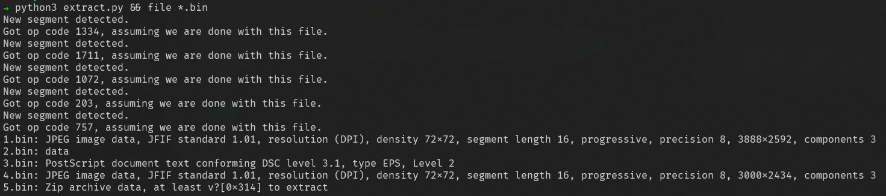

# FH01
> 500pts

## Briefing
> Download the file and find a way to get the flag.

## Solution
The provided file can be found [here](fh01.zip).

We are given a wireshark capture file. Looking through the TCP/UDP streams, we find an UDP stream `2` that seems to be some file transfer protocol.



It looks like the .129 address sends data to the .128 address in chunks of 626 bytes. We can use tshark to extract the data from the stream.

`tshark -r fh01.pcapng --disable-protocol wg --disable-protocol dcerpc --disable-protocol sigcomp --disable-protocol pathport -Y 'ip.src == 192.168.47.129 && frame.len == 626' -T fields -e data > extracted.dmp`

Breaking the arguments down:
```
-r      read from the input file
-Y      filter packets (ip.src == 192.168.47.129 && frame.len == 626)
-T      what we want tshark to export (a field)
-e      the field that we want tshark to extract (the data portion of the packet)
--disable-protocol <proto>     stops tshark from trying to dissect the payload into <proto>
```
We need to tell tshark not to dissect some protocols because it incorrectly dissects the UDP packet into them, meaning we lose the `udp.data` field. For example, frame 2050 is part of our transfer stream, but wireshark thinks it is WireGuard.


### Reversing the protocol
But we are not done yet, because the UDP data stream is not pure data. Looking at our extracted data, we figure out that the protocol being used is something like:
```
>> get <filename>

<< 
<segment id (8 bytes)> <op code (8 bytes)>
<data>

>> <segment id (8 bytes)> (ACK)
```
Thus, we need to process the extracted data a bit more. We can use a simple python script to trim the protocol lines and convert the ascii hexdump into actual bytes.


(2.bin is just a text file, but that doesn't really matter here)

The flag is in the zip file (5.bin) in the form of an image.

## Flag
Flag: `C4tch1ng_H0n3y_p0Ts_w1TH_a_Sh4rk!`

