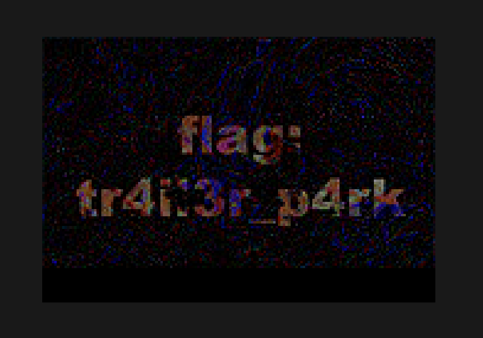

# FM01
> 250pts

## Briefing
> Download the file and find a way to get the flag.

## Solution
The provided file can be found [here](fm01.zip).

Deep fry the image in Photoshop to reveal the text `flag: tr4il3r_p4rk`:

We believe the intended solution for this challenge is to actually repair the jpeg! However, as the challenge was exported from Photoshop it means Photoshop embedded a 160px wide thumbnail into the exif data. This allows for a quick recovery of the flag! 

## Flag
Flag: `tr4il3r_p4rk`
