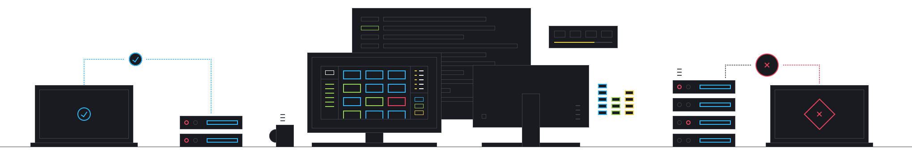

# Cyber FastTrack Spring 2021 / National Cyber Scholarship Competition - Spring 2021
Mon 5th April 17:00 BST - Wed 7th April 17:00 BST

> The CD Skids are back and playing for fun!

This CTF was run for both [Cyber FastTrack](https://cyber-fasttrack.org/) and [National Cyber Scholarship](https://www.nationalcyberscholarship.org/) at the same time. Although these writeups were primarily made for Cyber FastTrack, they should also be valid for the National Cyber Scholarship competition.

## Registration
* Register on [Cyber FastTrack's website](https://cyber-fasttrack.org/) to receive an email from the Capture-the-Flag platform, SANS Tomahawque. You’ll need to register with them to be able to play if you haven't used this platform before.
* Register on the [National Cyber Scholarship Foundation's website](https://www.nationalcyberscholarship.org/)

## Leaderboard
* [Cyber FastTrack - Spring 2021 Leaderboard](https://leaderboard.tomahawque.com/59be84c4-07c3-11eb-a736-303234643662/85fc7be248c4c75294f25cbe5e567b3e/)
* [National Cyber Scholarship Competition - Spring 2021 Leaderboard](https://leaderboard.tomahawque.com/943e22be-870a-11eb-8e55-636337383761/359e5c0b1998ff3e19014cb3b9239f64/)

## Challenge Difficulties
* Easy - 100pts
* Medium - 250pts
* Hard - 500pts
* Extreme - 1000pts

## Challenge Writeups
These have been organized in order they appear on the site:

### Binary
| Easy | Medium | Hard | Extreme |
|------|--------|------|---------|
|[BE01](Binary/BE01)|[BM01](Binary/BM01)|[BH01](Binary/BH01)|[BX01](Binary/BX01)|
|[BE02](Binary/BE02)|[BM02](Binary/BM02)||~~[BX02](Binary/BX02)~~|
||[BM03](Binary/BM03)|||

### Crypto
| Medium | Hard | Extreme |
|--------|------|---------|
|[CM01](Crypto/CM01)|~~[CH01](Crypto/CH01)~~|[CX01](Crypto/CX01)|
|[CM02](Crypto/CM02)|~~[CH02](Crypto/CH02)~~||

### Forensics
| Easy | Medium | Hard |
|------|--------|------|
|[FE01](Forensics/FE01)|[FM01](Forensics/FM01)|~~[FH01](Forensics/FH01)~~|
|[FE02](Forensics/FE02)|[FM02](Forensics/FM02)||
|[FE03](Forensics/FE03)|~~[FM03](Forensics/FM03)~~||
|[FE04](Forensics/FE04)|||

### Networking
| Easy | Medium |
|------|--------|
|[NE01](Networking/NE01)|[NM01](Networking/NM01)|

### Web
| Easy | Medium | Hard | Extreme |
|------|--------|------|---------|
|[WE01](Web/WE01)|~~[WM01](Web/WM01)~~|~~[WH01](Web/WH01)~~|[WX01](Web/WX01)|
|[WE02](Web/WE02)|[WM02](Web/WM02)|[WH02](Web/WH02)||
||~~[WM03](Web/WM03)~~|||
||[WM04](Web/WM04)|||
||[WM05](Web/WM05)|||

Please feel free to submit a PR to add a writeup that we don't have.

## Event Info & Code of Conduct
### Welcome to the Cyber FastTrack Capture the Flag (CTF).
Our challenges will test your creativity, technical skills and problem-solving ability. Identify your strengths and weaknesses as you analyze forensic data, break into vulnerable websites, and solve challenges built by industry experts!

### Rules of Engagement
1. You must participate fairly, as an individual, such that your score reflects your own individual ability. Telephone calls may be made after the event to validate your performance.
2. Identified cheating may result in ejection from the event, and a ban of the individual participant or their school including all participants thereunder. Anyone banned from the event will be disqualified from all prizes in this, and future Cyber FastTrack CTF competitions. Sharing of flags, challenge keys, or providing revealing hints to other participants are some examples of what activities are considered cheating; this should not be considered an exhaustive list. If you are unsure of the activity you are undertaking at any time please contact support@cyber-fasttrack.org.
3. During this competition you will be provided with access to challenges and content for you to solve. You agree not to share solutions, post blogs, or otherwise share solutions until the competition is closed. After this period sharing solutions and write-ups is thoroughly encouraged and does not require express permission from the service provider.
4. You may only use tools, techniques, or processes against the targets and endpoints identified in the challenge briefings, which you are given explicit permission to target. Use of the tools, techniques or processes against the infrastructure of the competition or other services outside the scope identified may be a violation of (amongst others) the Computer Misuse Act 1990 of the United Kingdom or the Computer Fraud and Abuse Act of the United States. In circumstances where error cannot be blamed, violation could result in rejection from this event, the Cyber FastTrack program, or prosecution by the relevant legal authority. If you are unsure of the activity you are undertaking at any time please contact support@cyber-fasttrack.org.
5. You agree not to intentionally disrupt the service, the provided challenges or infrastructure such as through the use of Distributed Denial of Service attacks. Doing so may result in termination of your access, or sharing of your information with the relevant legal authorities. It is not acceptable to attempt denial of service attacks, or to purposefully attempt to cause damage to the infrastructure or data, nor is it acceptable to identify flaws and to purposefully attempt to damage or disrupt other platform users, or their data.
6. Absolutely no sabotaging of other competing participants, or in any way hindering their independent progress.

Good luck!

## Advice from James Lyne
Unsure if you should compete? We've got some advice from [James Lyne](https://vimeo.com/533139549/d8fdd9fd46)!

## Contributors
Thanks to all the contributors who have solved challenges and submitted writeups to this repository:
* [Josh Heng](https://github.com/JoshHeng/)
* [404dcd](https://github.com/404dcd/)
* [Bottersnike](https://github.com/Bottersnike/)
* [Isaiah](https://github.com/RealJammy)
* [Alice](https://github.com/Alic3C)
* [Das](https://github.com/das-12)

And of course:
* [James Lyne](https://github.com/jameslyne)
* [The 5.6 Video Account](https://twitter.com/WaitingVideo)
* [Sponsored by RACTF](https://www.ractf.co.uk/)
* [Sponsored by Beano Industries](https://beano.dev/carers)

